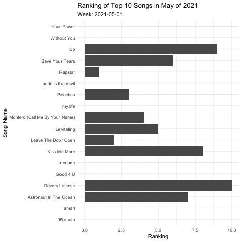

```{r setup, include=FALSE}
knitr::opts_chunk$set(echo = TRUE, error=TRUE, message=FALSE, warning=FALSE)
```

```{r libraries}
library(tidyverse)     # for graphing and data cleaning
library(lubridate)     # for date manipulation
library(ggthemes)      # for even more plotting themes
library(gganimate)
library(gifski)
theme_set(theme_minimal()) # My favorite ggplot() theme :)
```


```{r}
billboard <- readr::read_csv('https://raw.githubusercontent.com/rfordatascience/tidytuesday/master/data/2021/2021-09-14/billboard.csv')
```

```{r}
billboard %>% 
  mutate(week = as.Date(week_id,"%m/%d/%Y")) %>% 
  filter(week >= as.Date("2021-05-01") & week <= as.Date("2021-06-01")) %>% 
  arrange(week_position) %>% 
  group_by(week) %>% 
  slice(1:10) %>% 
  ggplot(aes(x = week_position, 
             y = song)) +
  geom_col() + 
  labs(title = "Ranking of Top 10 Songs in May of 2021", 
       subtitle = "Week: {frame_time}",
       x = "Ranking",
       y = "Song Name") + 
  transition_time(week)
```
```{r}
anim_save("billboard.gif")
```
```{r}

```

