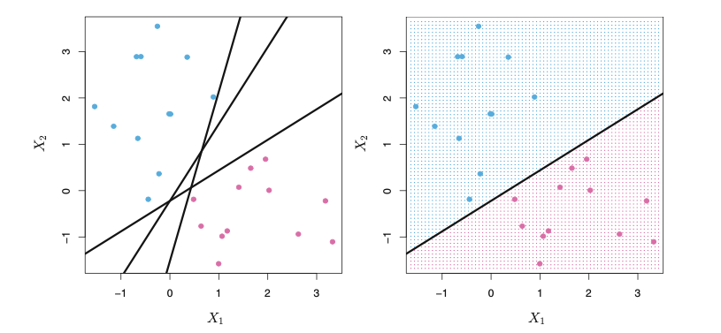
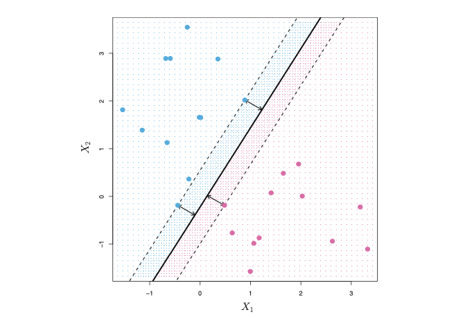
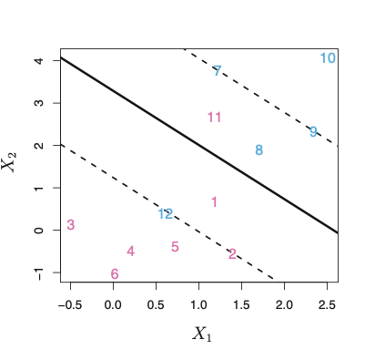
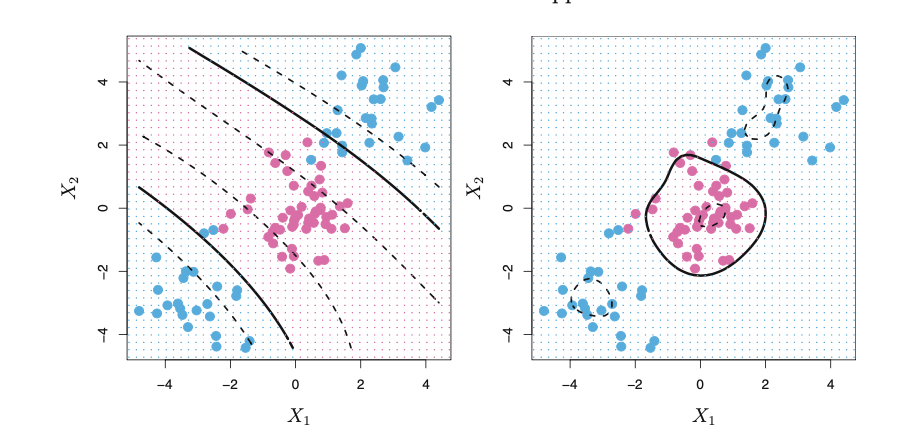

```{r setup, include=FALSE}
knitr::opts_chunk$set(echo = TRUE, error=TRUE, message=FALSE, warning=FALSE)
```


\
\

## Setting Up
```{r}
library(ggplot2)
library(caret)
library(e1071)
library(ROCR)
library(dplyr)
library(palmerpenguins)
library(pROC)
```

## Part 1: SVM Overview


### Placement within the machine learning workflow

SVM vs Logistic Regression: SMV is also a parametric model and it will be more advantageous when the boundaries between different catergories are not linear.  

SVM vs KNN: Both of the model allow non-linear boundaries for classification. However, when we have many predictors or features, SVM would perform better than KNN because KNN suffers from curse of dimensionality.  

SVM vs tree: I personally think that SVM is a less greedy algorithm comparing to tree model because tree makes best splits without considering the future split. However, for SVM, we won't have such a concern. 

### Definition

In short, the SVM model uses a separating hyperplane to classify observations.
\
A separating hyperplane $f(x_1,x_2,...,x_n)$ is a plane in space which can separate different levels of the observations based on the features. The observations fall into two classes, we use -1 to represent one class and 1 to represents the other class,that is $y_{i} ∈ \{-1,1\}$. As a result, a hyperplane has the following property: 
$y_{i}*f(x_1,x_2,...,x_n) > 0$. 

\

However, there are many hyperplanes that can separate the observations, as we can see from the figure below.

Since we want to choose the plane that best separates two classes, we want the plane to have the farthest minimum distance or margin from the observations. In the language of math, that is, $y_{i}*f(x_1,x_2,...,x_n) > = M$, where M is the farthest minimum distance from the hyperplane to the observations. 
\
As we can see from the figure below, three training observations are on the dashed line, meaning that the distance between these three observations and the separating hyperplane is the margin. Those points are support vectors, because if they move, the hyperplane would change. 

\
Not all observations can be perfectly separated into two classes by a plane and we could allow misclassifying of some a few observations by adding slack variables $ε$ and the hyperplane satisfies $y_{i}*f(x_1,x_2,...,x_n) > = M*(1-ε_i)$. When $ε_i=0$, the observation is on the correct side of the margin; when $ε_i>0$, the observation is on the wrong side of the margin; and when $ε_i>1$, it's on the wrong side of the plane. For example, as the graph below demonstrates, observation 12 and 11 would have a slack variable bigger than 1 because they are on the wrong side of the hyperplane. 



\
Hyperplane function $f(x_i)$ can have different forms or take in different kernels which allow us to have non-linear boundaries. For example, in the graph below, the figure on the left uses a polynomial kernel and the figure on the right uses a radial kernel.  

\
\
\

### Tuning
The tuning parameter for SVM is cost, which is defined as the sum of $εi$. When the cost is big, the width of the margin will be wilder and many points can violate the margin. While when the cost is small, the width of the margin will be small and fewer misclassifications will be tolerated. 
\
Besides cost C, there are other tuning parameters according to what kernels we use. If we use the radial kernel, we also need to decide on sigma. The larger the sigma, the more non-linear is the boundary. And for the polynomial kernel, two other tuning parameters are scale, which helps us to normalize the pattern, and degree, which sets the degree for the kernel. 

### Potential drawbacks
SVM attempts to use a hyperplane to divide classes. However, when there are many noises in the observation, SVM probably cannot perform very well. Moreover, unlike tree and KNN, SVM does not allow us to classify observations to more than two levels. Also, we can't get a probabilistic result like those generated by logistic models.

\
\
\
```{r}
# Import raw data
data(penguins)

# Check out the codebook by typing this in your console
#?penguins

# Create a new hybrid 
# And take a smaller sample (just for the purposes of this project)
set.seed(253)
new_penguins <- penguins %>% 
  mutate(species = case_when(
    species %in% c("Adelie","Gentoo") ~ "Adelgen",
    species == "Chinstrap" ~ "Chinstrap"
  )) %>% 
  group_by(species) %>% 
  sample_n(68)

# preprocess the data
new_penguins <- new_penguins %>%
  select(-year)%>%
  mutate(island=as.factor(island))

```

## Part 2: Using SVM on Pengiuns Classification (Selected Variables)

> This section, I will use the SVM model introduced before to predict the species of pengiuns. Here, I only use the bill_length and bill_width as predictors.  

### Kernel selection: linear, radial, or polynomial?

> There are three methods for the SVM model: linear, radial, and poly. Using different methods will give us different types of separating hyperplanes. To choose the method that can best capture the differences between groups, I first studied the bill length and bill depth of different species by looking at the scatterplot. According to the graph, the boundary between Adelgen and Chinstrap seems to be an ellipse so my initial guess is that svmRadical would be a more proper method. 

```{r}
new_penguins %>% 
  ggplot(aes(x=bill_length_mm,y=bill_depth_mm,color=species))+
  geom_point()
```
\


> Then I built three SVM models using "svmRadial", "svmLinear", and "simply" separately to compare their cv accuracy and to decide which model generated the most accurate predictions.  Below shows the cv accuracy of using "svmRadial", "svmLinear", and "svmPoly" respectively. Note that the caret package will automatically choose the optimal model tuning parameters, where optimal is defined as values that maximize the cv accuracy (Campbell,2020). As we can see, the cv accuracies of the models built using "svmRadial" and "svmPoly" are the same and both are higher than the cv accuracy generated by using "svmLinear": on average, there is 0.9619 chance to guess the species of a penguin right using these two model. Integrating my previous guess based on the scatterplot, I would choose to use "svmRadial". Now the problem is what tuning parameter to choose. 

```{r}
set.seed(253)
svmR <- train(
     species~ bill_length_mm + bill_depth_mm,
    data = new_penguins,
    method = "svmRadial",
    trControl = trainControl(method = "cv", number = 10, classProbs = TRUE),
    tuneLength = 10,
    metric = "Accuracy",
    na.action = na.omit
)
svmR$results %>% filter((sigma==svmR$bestTune$sigma) & (C==svmR$bestTune$C) )
```

```{r}
set.seed(253)
svmL <- train(
     species~ bill_length_mm + bill_depth_mm,
    data = new_penguins,
    method = "svmLinear",
    trControl = trainControl(method = "cv", number = 10),
    tuneLength = 10,
    metric = "Accuracy",
    na.action = na.omit
)
svmL$results %>% filter(C==svmL$bestTune$C)
```

```{r}
set.seed(253)
svmP <- train(
    species~ bill_length_mm + bill_depth_mm,
    data = new_penguins,
    method = "svmPoly",
    trControl = trainControl(method = "cv", number = 10),
    tuneLength = 4,
    metric = "Accuracy",
    na.action = na.omit
)
```


```{r}
svmP$results %>% filter((degree==svmP$bestTune$degree)&(C==svmP$bestTune$C)&(scale==svmP$bestTune$scale))
```


> The model suggests the best tuning parameter is when sigma = 3.663707 and cost = 0.5. As we can see from the graph, when we choose tuning parameter cost = 0.5, the cv accuracy is indeed the highest.

```{r}
svmR$bestTune
plot(svmR)
```


### Comparision with the logistic model

> I first looked at the confusion matrix of both models. First of all, for both models, P-Value [Acc > NIR] are small, suggesting that both model perform better than we doing a random guess. However, both sensitivity and specificity using "svmRadial" model are higher and the in-sample accuracy is also higher for "svmRadial" model (0.99>0.85). Therefore, it seems that "svmRadial" model does a better job for in-sample prediction, which is also supported by the ROC graph. The black line is the ROC for my SVM model and the red curve is the ROC for logistic model. The area under the curve for SVM model is bigger, showing that using SVM model, we has a higher probability to correctly identify Adelgen penguins as Adelgen, Chinstrap penguins as Chinstrap. 

```{r}
set.seed(253)
logistic_model <- train(
    species ~ bill_length_mm+bill_depth_mm,
    data = new_penguins,
    method = "glm",
    family = "binomial",
    trControl = trainControl(method = "cv", number = 10),
    metric = "Accuracy",
    na.action = na.omit
)

```


```{r}
predict_data <- na.omit(svmR$trainingData)
#p1<-predict(svmR,predict_data)
#roc(response=predict_data$.outcome,pred=as.numeric(p1),plot=TRUE, legacy.axes=TRUE)
classifications_svmR <- predict(svmR, newdata = predict_data, type = "raw")
confusionMatrix(data = classifications_svmR, 
  reference = as.factor(predict_data$.outcome), 
  positive = "Adelgen")
```
```{r}
classifications_log <- predict(logistic_model, newdata = predict_data, type = "raw")
confusionMatrix(data = classifications_log, 
  reference = as.factor(predict_data$.outcome), 
  positive = "Adelgen")
```
```{r, warning=FALSE,message=FALSE}
p1<-predict(svmR,predict_data)
roc(response=predict_data$.outcome,pred=as.numeric(p1),plot=TRUE, legacy.axes=TRUE)
par(new=TRUE)
roc(response=predict_data$.outcome,pre=fitted(logistic_model),plot=TRUE,legacy.axes=TRUE,col=2)
```

> Then I compared the cross-validation accuracy of these two models. First of all, the cv accuracies for both models are similar to the in-sample accuracy, suggesting that non of them overfits the data. The cv accuracy for the "svmRadial" model is 0.9619048 and the cv accuracy for the logistic model is 0.8440476, meaning that on average, we would have a higher chance to correctly classify a penguin using the "svmRadial" model. 

```{r}
svmR$results %>% filter((sigma==svmR$bestTune$sigma) & (C==svmR$bestTune$C) )
logistic_model$results
```

> Using both in-sample and cross-validation approaches, "svmRadial" seems to be a better model. Graphs below show the classification regions defined by my SVM model and the logistic model.  As we can see, when we use the "svmRadial", there are only about 3 cases in the sample that has been misclassified. However, when we used the logistic model, many cases are misclassified. These illustrations also help to prove that the "svmRadial" model might be a better classification model for this dataset.


```{r }
penguins_data<-new_penguins %>% mutate(species=as.factor(species)) %>% select(species,bill_length_mm,bill_depth_mm)
```

```{r}
svmRfit=svm(as.factor(species)~bill_depth_mm+bill_length_mm, data=new_penguins, kernel="radial", cost=0.5,gamma=3.663707)
plot(svmRfit,penguins_data)
```
```{r,eval=FALSE}
logistic_model$finalModel
clog <- function(x){
  y=(1/1.2608)*(39.8641-0.3964*x)
  return (y)
}
```
```{r}
new_penguins %>% 
  ggplot(aes(x=bill_length_mm,y=bill_depth_mm,color=species))+
  geom_point()+
  geom_abline(intercept=39.8641/1.2608, slope = -0.3964/1.2608, linetype='solid', color='black')
```


\
\
\
\
\
\


## Part 3: Using SVM on Pengiuns Classification (All Variables)

> This section, I will use the SVM model introduced before to predict the species of pengiuns. Here, I only use the bill_length and bill_width as predictors.  

### Kernel & tuning parameter selection 

> Similar to what I did in the previous part, to classify penguins using all the predictors in the dataset, I first compared the results using "svmLinear", "svmRadial", and "svmPloy" to decide which method generates better results. It turns out that "svmPoly" and "svmLinear" might be better methods than "svmRadial" because "svmRadial" has a lower cross-validation accuracy compare to the other two methods. The three graphs below show the relationship between the cost and the cross-validation accuracy using "svmRadial", "svmLinear", and "svmPloy" respectively. they visually demonstrate that on average, using "svmLinear" and "svmPloy" would have a higher chance to correctly classify the penguins. According to "svmPoly", the best degree that optimizes the cv accuracy is 1, suggesting that a linear kernel might be a reasonable choice. Therefore, I would choose using "svmLinear" with a cost of 6.210526, which also makes sense by looking at the graph: when the cost is 6.210526, the cv accuracy is higher than using other tuning parameters.  

```{r}
set.seed(253)
svmR_f <- train(
     species~ .,
    data = new_penguins,
    method = "svmRadial",
    trControl = trainControl(method = "cv", number = 10),
    tuneLength = 10,
    metric = "Accuracy",
    na.action = na.omit
)
svmR_f$results %>% filter((sigma==svmR_f$bestTune$sigma) & (C==svmL$bestTune$C))
```

```{r}
set.seed(253)
svmL_f <- train(
    species~ .,
    data = new_penguins,
    method = "svmLinear",
    trControl = trainControl(method = "cv", number = 10, classProbs = TRUE),
    tuneGrid = data.frame(C = seq(1, 100, length = 20)),
    metric = "Accuracy",
    na.action = na.omit
)
svmL_f$results %>% filter(C==svmL_f$bestTune$C)
```


```{r}
set.seed(253)
svmP_f <- train(
    species~ .,
    data = new_penguins,
    method = "svmPoly",
    trControl = trainControl(method = "cv", number = 10),
    tuneLength = 4,
    metric = "Accuracy",
    na.action = na.omit
)
svmP_f$results %>% filter((degree==svmP_f$bestTune$degree) & (C==svmP_f$bestTune$C) & (scale==svmP_f$bestTune$scale))
```


```{r}

set.seed(253)
svmP_f2 <- train(
    as.factor(species)~ .,
    data = new_penguins,
    method = "svmPoly",
    trControl = trainControl(method = "cv", number = 10),
    tuneGrid = data.frame(C=c(0.25,0.5,1,2),degree=1,scale=1),
    metric = "Accuracy",
    na.action = na.omit
)
```

```{r}
plot(svmR_f)
plot(svmL_f)
plot(svmP_f2)
```

### Comparison with logistic model
> Similarly, to compare my SVM model with the logistic model, I took in-sample and cross-validation approaches. Both models perform well for in-sample data. Logistic model is slightly better with in-sample classification, with an accuracy of 1 and both sensitivity and specificity being 1. Their ROC curves (showing below) are also very close together and the areas under the curve are both about 1. (The red one is the ROC curve by logistic model and the black line is the ROC curve for my SVM model.) However, my SVM model does have a higher cv accuracy (0.99>0.97). Therefore, my SVM model is slightly better in terms of classifying penguins outside of our sample. 

```{r, message=FALSE, warning=FALSE}
set.seed(253)
logistic_f_model <- train(
    as.factor(species) ~ .,
    data = new_penguins,
    method = "glm",
    family = "binomial",
    trControl = trainControl(method = "cv", number = 10),
    metric = "Accuracy",
    na.action = na.omit
)

```

```{r}
predict_data_f <- na.omit(svmL_f$trainingData)
classifications_svmL_f <- predict(svmL_f, newdata = predict_data_f, type = "raw")
confusionMatrix(data = classifications_svmL_f, 
  reference = as.factor(predict_data_f$.outcome), 
  positive = "Adelgen")
```

```{r}
classifications_log_f <- predict(logistic_f_model, newdata = predict_data_f, type = "raw")
confusionMatrix(data = classifications_log_f, 
  reference = as.factor(predict_data_f$.outcome), 
  positive = "Adelgen")
```

```{r,warning=FALSE,message=FALSE}
predict_data2<-na.omit(svmL_f$trainingData)
p2<-predict(svmL_f,predict_data2)
roc(response=predict_data2$.outcome,pred=as.numeric(p2),plot=TRUE, legacy.axes=TRUE)
par(new=TRUE)
roc(response=predict_data2$.outcome,pre=fitted(logistic_f_model),plot=TRUE,legacy.axes=TRUE,col=2)
```

```{r}
svmL_f$results %>%filter(C==svmL_f$bestTune$C)
logistic_f_model$results
```


\
\
\
\
\
\


## Part 4: What the Model Shows?

> With the SVM model obtained in the previous part, we can learn some themes about each classification. Below is a summary of average penguins' features in each classification. As we can see, both from the summary, Chinstrap penguins tend to have longer and deeper bill compare to Adelgen penguins. 

> Also, Chinstrap seems to have shorter flippers in general, since the average flipper length for Chinstrap penguins is smaller. Moreover, by looking at the histograms of flipper length, we can also notice that within Adelgen penguins, the length of flippers has a wide range: some have very short flippers while some have very long flippers. Similarly, for body mass, Adelgen penguins tend to have a wider range of body mass while Chinstrap penguins tend to be less heavy in general. 

> By looking at the summary, all Chinstrap penguins live in Dream island while most Adelgen penguins live in Biscoe island with only a small group living in the other two islands.

> In summary, based on the classification model in the previous part, we learn that Chinstrap penguins tend to have longer bill and deeper bill, shorter flipper, lower body mass, and live in Dream island; Adelgen penguins tend to have shorter and shallow bills, diverse length of the flipper and body mass, and mostly live in Biscoe island. 

```{r,message=FALSE, warning=FALSE}
my_model <- svm(as.factor(species)~.,new_penguins, kernel='linear',
              cost=svmL_f$bestTune$C, decision.values=T)
ls=data.frame(predict(my_model,new_penguins))

penguins_with_cluster <- new_penguins %>%
  mutate(sex=as.numeric(as.factor(sex))-1)%>%
  na.omit() 
penguins_with_cluster <- merge(penguins_with_cluster,ls, by.x = 0, by.y = 0) %>% rename(predicted=predict.my_model..new_penguins.
) %>% 
  mutate(predicted=as.factor(predicted)) %>%
  select(-Row.names)

penguins_with_cluster<-penguins_with_cluster %>% mutate(islandDream=case_when(
  island=='Dream'~ 1, island!='Dream'~0))%>%
  mutate(islandBiscoe=case_when(
  island=='Biscoe'~ 1, island!='Biscoe'~0)) %>%
  mutate(islandTorgersen = case_when(
  island=='Torgersen'~ 1,island!='Torgersen'~0))
```


```{r,message=FALSE,warning=FALSE}
penguins_with_cluster %>% group_by(as.factor(predicted)) %>% summarise_all(mean)
```
```{r, message=FALSE, warning=FALSE}
par(mfrow=c(2,2))
penguins_with_cluster%>%
  ggplot(aes(x=bill_depth_mm))+
  geom_histogram()+
  labs(title = "Bill depth by classifications")+
  facet_wrap(~as.factor(predicted))
penguins_with_cluster%>%
  ggplot(aes(x=bill_length_mm))+
  geom_histogram()+
  labs(title = "Bill length by classifications")+
  facet_wrap(~predicted)
penguins_with_cluster%>%
  ggplot(aes(x=flipper_length_mm))+
  geom_histogram()+
  labs(title = "Flipper length by classifications")+
  facet_wrap(~predicted)

penguins_with_cluster%>%
  ggplot(aes(x=body_mass_g))+
  geom_histogram()+
  labs(title = "Body mass by classifications")+
  facet_wrap(~predicted)
```
```{r,message=FALSE, warning=FALSE}
penguins_with_cluster%>%
  ggplot(aes(x=as.factor(sex)))+
  geom_bar()+
  labs(title = "Sex by classifications")+
  facet_wrap(~predicted)

penguins_with_cluster%>%
  ggplot(aes(x=as.factor(island)))+
  geom_bar()+
  labs(title = "Island by classifications")+
  facet_wrap(~predicted)

```


\
\
\
\
\
\


## Reference:
James, G., Witten, D., Hastie, T., &amp; Tibshirani, R. (2017). An introduction to statistical learning with applications in R. New York: Springer.
\
Campbell, J. (2020). SVM with caret. Retrieved December 13, 2020, from https://rpubs.com/uky994/593668


